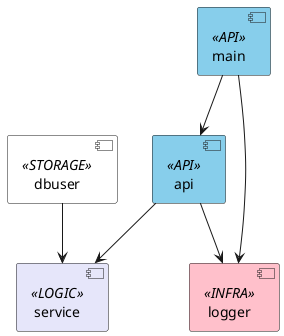

# go-mongodb-crud-example
Example of REST API.  

Includes:    
- oapi-codegen;  
- go-chi;  
- Zap logger;  
- MongoDB;  
- Docker;
- Docker Compose.

## Description

Sample project for educational purposes.  
There are 2 ideas:  
- checking and glueing together technologies mentioned above;
- sharing my own experience for the ones who want to glue the same technologies.

## Package Diagram

## Generate

API boilerplate code is generated using `oapi-codegen` tool from the `openapi.yaml` file.  
It's great tool that makes your actual API reflect the documentation.  

Get it there:  
`https://github.com/deepmap/oapi-codegen`  

And make sure that your `GOPATH/bin` path presents in `PATH` variable.  

Use this command to generate the `api.go` file:  
- `oapi-codegen --package=api --generate=types,chi-server openapi/openapi.yaml > internal/api/api.go`  

## Running

### Running

Use `go run .` from the folder that contains `main.go`.

### Running via Docker (no compose)

Get the image here:  
`https://hub.docker.com/_/mongo`  

Create network and volume:   
- `docker network create db_network`  
- `docker volume create mongo-vol`  

Run db container:  
- `docker run -it --rm -p 27017:27017 --name mongodb-0 --network db_network --mount source=mongo-vol,target=/var/lib/docker/volumes/mongo-vol/_data mongo:5.0.6`  
After that you can run your using `go run` if you need.

Build the app image and run:  
- `docker build -t go-mongodb-app:v0.1.0 .`  
- `docker run -it -p 8080:80 --name go-mongodb-app-0 --network db_network go-mongodb-app:v0.1.0`  

### Running via Docker Compose

As simple as:  
- `docker-compose build`  
- `docker-compose up`  