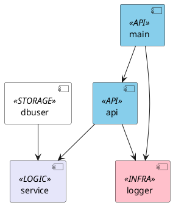

## Package Diagram

GitLab syntax supports PlantUML.  
I don't know how to use it here on GitHub other then import the png, unfortunately :(

```plantuml

@startuml

skinparam component {
    BackgroundColor White
    BackgroundColor<<API>> SkyBlue
    BackgroundColor<<STRORAGE>> LightGreen
    BackgroundColor<<INFRA>> Pink
    BackgroundColor<<LOGIC>> Lavender
}

[api] <<API>>
[service] <<LOGIC>>
[dbuser] <<STORAGE>>
[logger] <<INFRA>>
[main] <<API>>

api --> service
dbuser --> service
main --> api
api --> logger
main --> logger

@enduml
```